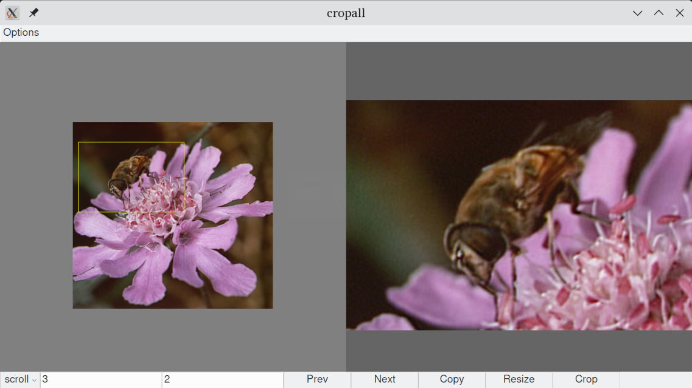

# cropall



A small cross-platform python script to interactively crop and resize lots of
images images quickly. Image editors like gimp take way too long to start, open
an image, crop it, export it. A batch job/script can automate it but everything
gets cropped at the same positions. This app sits in the middle, automating
loading/clicking crop/save/next so your amazing human vision can be used to
quickly select what needs to be cropped and not wasted on navigating clunky GUI
hierarchies.

This is really a minimal GUI and preview for the following imagemagick command:

    convert in.jpg -crop <region> -resize <fit> out.jpg

This script actually uses imagemagick under the hood for its fast and high
quality resampling algorithms. The GUI shows a quick and low quality preview.

## Usage

Download a pre-built from the
[releases](https://github.com/pknowles/cropall/releases) section on github.
These are self contained packages created with pyinstaller.

Alternatively, grab the source and dependencies. I hope it's simple enough that
people with a little python experience can adapt it as needed.

```
git clone https://github.com/pknowles/cropall.git
cd cropall
python -m venv .venv

# linux
. .venv/bin/activate

# windows
. .venv/Scripts/Activate

pip install -r requirements.txt
python cropall.py

# Install ImageMagick https://docs.wand-py.org/en/latest/guide/install.html
# E.g.:

# Ubuntu
sudo apt-get install libmagickwand-dev

# Fedora
sudo dnf install ImageMagick-devel

# Windows (make sure to match python x86 or x64)
# Download dll from: https://imagemagick.org/script/download.php#windows

# Optional: create the standalone binary distribution
pyinstaller cropall.spec
```

Feel free to report issues and pull requests are most welcome, thank you! I
can't promise I'll get to them immediately sorry.

## Forks and alternatives

- [@rystraum](https://github.com/rystraum/cropall) has added a number of
  features such as rotation and keyboard shortcuts. See
  [#2](https://github.com/pknowles/cropall/issues/2).
- There's a great list of alternatives here:
  https://askubuntu.com/questions/97695/is-there-a-lightweight-tool-to-crop-images-quickly
- E.g.: https://github.com/weclaw1/inbac

## License

The python source code here is under GPL v3.

```
This program is free software: you can redistribute it and/or modify
it under the terms of the GNU General Public License as published by
the Free Software Foundation, either version 3 of the License, or
(at your option) any later version.

This program is distributed in the hope that it will be useful,
but WITHOUT ANY WARRANTY; without even the implied warranty of
MERCHANTABILITY or FITNESS FOR A PARTICULAR PURPOSE.  See the
GNU General Public License for more details.

You should have received a copy of the GNU General Public License
along with this program.  If not, see <http://www.gnu.org/licenses/>.
```

### Third party code

Pre-built binaries of ImageMagick are included with the distribution. See:
https://imagemagick.org/script/license.php

The release distribution includes various scripts and binaries collected by
`pyinstaller`. Licenses found in the venv directory are included by
`cropall.spec`.
